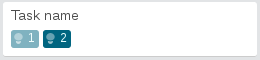

Extended Scrum for Trello
=========================
*(This repo is fork of extension providing great base for improvements needed in our team and below is original readme)*

Usage
=====
*note: features with * symbol are already present in original scrum for trello*

Adding story points to a card by typing the number in a round parenthesis: *

`(2) Task name`

Adding consumed story points to a card by typing the number in a square brackets: *

`(2) Task name [1]`

You can substitute points for a raw cash amount easily like:

`($ 100) Research for customer in cash [$ 50]`

Or specify a story point value in curly brackets and it will be displayed automatically as:

`(2) Task name [1] {500}`

You can also define a special header that will be transformed into a list separator with intermediate sum.

`*** Wololo ***`

Installation
------------

1. Clone this repository
2. Go to `chrome://extensions/` and load this repository's folder as an *unpacked extension*

Original Scrum for Trello
=========================

Original Scrum for Trello adds functionality to the awesome trello.com for use in Scrum projects.

Trello is the perfect online equivalent of the whiteboard with sticky notes aka the Scrum
board. One element we use are the story points. TrelloScrum gives you the ability to
make use of story points in Trello.

Setup
-----

Scrum for Trello is a Chrome extension and you can install it via the Chrome Webstore.
Or, **clone this repository and load the TrelloScrum folder as an unpacked extension**.

How does it work?
-----------------
In the card titles you can add the story points between parentheses. The assigned points
will be picked up by TrelloScrum and displayed in the upper right corner of the card.

For each list the total amount of story points will be calculated and shown in the title
of the list.

Every second the story points will be detected and calculated. So changing a number or moving
a card will be reflected almost immediately.

Credits
-------
Original TrelloScrum was developed by [Marcel Duin](http://webglmarcel.q42.net/) and [Jasper Kaizer](https://twitter.com/jkaizer)
during our pet projects time at [Q42](http://q42.com).

Great improvements made by @nicpottier and @paullofte:

* The point value is moved to be a badge on the card.
* Added support for Zero Point Cards (0), Unknown Point Cards (?), Decimal Value Cards (.5)
* In addition I added the functionality to have the list total reflect the current filtered set of cards.

